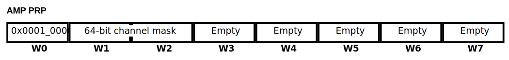
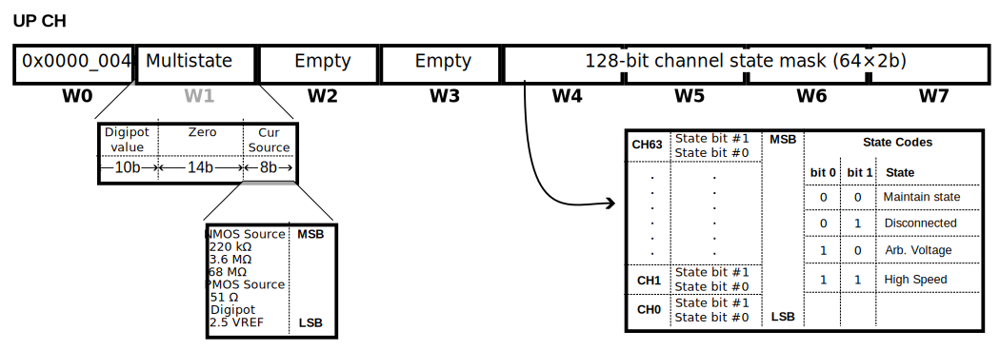
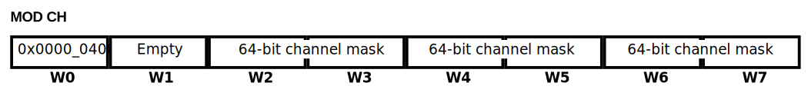
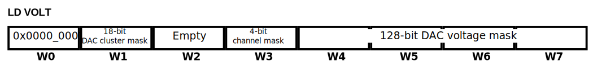
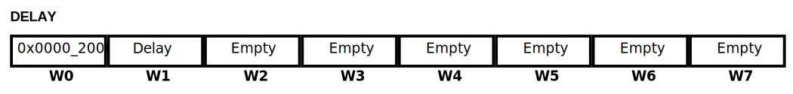
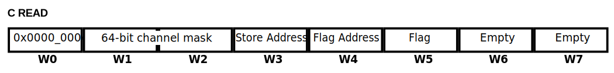
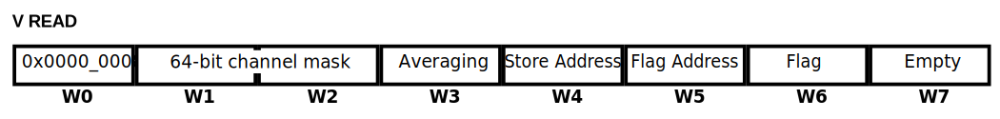
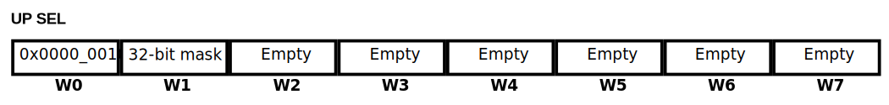
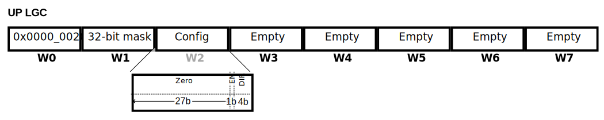

ArC TWO protocol
================

Introduction
------------

ArC TWO reads instructions over USB port and collects them into an internal
command buffer. Instructions are always 9 WORDs long. A WORD in the context of
this document is an unsigned 32-bit value. The first WORD is the instruction
opcode, WORDs 2 to 8 are the arguments of the instruction and WORD #9 is the
end-of-instruction marker. This document illustrates the instructions ArC TWO
understands. Please note that these are provided for information and
documentation purposes only. If you want to interact with an ArC TWO board
please do so through our Python libraries or GUI Applications. Instructions
with arguments smaller than 8 words are padded with the ``Empty`` WORD which is
``0x8000_8000``. Please note that everything in this document is 0-indexed.

List of supported instructions
------------------------------

CLR: Clear ArC TWO State
~~~~~~~~~~~~~~~~~~~~~~~~

| **OPCODE**: 0x0000_0080

Reset the hardware to default state. All switches open and DACs at 0.0 V

AMP PREP: Prepare Op-Amps for Transition
~~~~~~~~~~~~~~~~~~~~~~~~~~~~~~~~~~~~~~~~

| **OPCODE**: 0x0001_0000

.. list-table:: AMP PRP Arguments
   :widths: 12 25 12 51
   :header-rows: 1

   * - Position
     - Name
     - Length
     - Description
   * - 1
     - DAC Bitmask
     - 2 WORDs
     - Selected channels to apply AMP PRP (LSB)

Connect feedback resistors to the op-amp in a controlled manner to avoid
transients on the selected channels (words 1 and 2). AMP PRP must be issued
before transitions from and to High Speed pulsing configurations

UP CH: Update Channel Configuration
~~~~~~~~~~~~~~~~~~~~~~~~~~~~~~~~~~~

| **OPCODE**: 0x0000_0040

.. list-table:: UP CH Arguments
   :widths: 12 25 12 51
   :header-rows: 1

   * - Position
     - Name
     - Length
     - Description
   * - 1
     - Digipot config (bits 0-9)
     - 10 bits
     - Digipot resistor (1-Dv/1024)×20 kΩ
   * -
     - Padding
     - 14 bits
     - Fill space to 32 bits
   * -
     - Current Source config (bits 24-32)
     - 8 bits
     - Current Source State Code
   * - 4
     - Channel state code
     - 4 WORDs
     - Configuration for all 64 channels

Set the state of the range and High Speed driver switches in the channels
along with the state of the switches in the current source and the range
of the digipot.

MOD CH: Modify Channel State
~~~~~~~~~~~~~~~~~~~~~~~~~~~~

| **OPCODE**: 0x0000_0400

.. list-table:: MOD CH Arguments
   :widths: 12 25 12 51
   :header-rows: 1

   * - Position
     - Name
     - Length
     - Description
   * - 2
     - Channel Bitmask
     - 2 WORDs
     - Selected channels to hard GND
   * - 4
     - Channel Bitmask
     - 2 WORDs
     - Selected channels to analogue GND
   * - 6
     - Channel Bitmask
     - 2 WORDs
     - Selected channels to current source

The *MODIFY CHANNEL* instruction sets the state of GND, analogue GND and current
source connect switches in the channels. It will not change the state of the
switches previously set by the *UPDATE CHANNEL* instruction.

LD VOLT: Set DAC Voltages
~~~~~~~~~~~~~~~~~~~~~~~~~

| **OPCODE**: 0x0000_0001

.. list-table:: LD VOLT Arguments
   :widths: 12 25 12 51
   :header-rows: 1

   * - Position
     - Name
     - Length
     - Description
   * - 1
     - Padding
     - 14 bits
     - Pad argument to 1 WORD
   * -
     - DAC Cluster Bitmask
     - 18 bits
     - DAC Cluster selection (see below)
   * - 2
     - Padding
     - 1 WORD
     -
   * - 3
     - Padding
     - 28 bits
     - Pad argument to 1 WORD
   * -
     - Channel bitmask
     - 4 bits
     - Select channel in DAC cluster (see below)
   * - 4
     - Voltage configuration
     - 4 WORDs
     - Set voltage to cluster channels

The *LD VOLT* instruction is the basic tool for setting channel voltages. In
order for the instruction layout to make sense, some information is required on
how the individual channels in ArC TWO are accessed. Each ArC TWO channel is
connected to a DAC output. There are 8 channel DACs on board (so 8 channels per
board) and 2 auxiliary DACs. We call each set of 8 channels connected to a DAC
a *channel cluster*.  Addressing of the channels is done on a *half-cluster*
basis. Word #1 selects the half-cluster the instruction will operate. Similarly
word #3 selects the channel *within the cluster*.

.. DANGER::
   Beware that incorrect configuration of the DAC outputs might result in
   damage to the ArC TWO DACs. End users are heavily encouraged to use the
   user-facing libraries to interact with the hardware rather than issuing raw
   instructions.

The final 4 words set the voltage for each one of the channels selected in the
channel bitmask (word #3). Bits not asserted in word #3 will leave
corresponding channels unaffected. Each voltage is represented by a 32-bit
value. Each channel can be differentially biased with the upper 16 bits of the
voltage corresponding to the DAC+ output and the lower 16 bits corresponding to
the DAC- output. For normal biasing situation (non high speed) both values are
usually set to the desired voltage, whereas in high speed operations the values
of the DAC+/DAC- parts depend on the type of biasing used. **DAC+ should always
be higher than DAC- to avoid potential damage to the instrument**.

Assuming ``c`` is the index of the asserted bit in word #1 and ``i`` the index
of the asserted bit in word #3 the last four words will correspond to the
following channels. Bottom row indicates the bit in word #3 that needs to be
asserted in order for the voltage to be applied.

.. list-table:: Voltage selection within a half cluster
   :widths: 2 1 1 1 1
   :header-rows: 1
   :align: center

   * -
     - Word #4
     - Word #5
     - Word #6
     - Word #7
   * - Corresponding channel
     - 4*c + 0
     - 4*c + 1
     - 4*c + 2
     - 4*c + 3
   * - Word #3 bit that needs asserting
     - Bit 3
     - Bit 2
     - Bit 1
     - Bit 0

You can assert different half-cluster and channel bits to compile a suitable
DAC configuration for a given biasing scheme. All biasing functions in pyarc2
will make a best effort to minimise the number of LD VOLT instructions
required.

The DAC values are linearly distributed over 16 bits with ``0x0000`` being
-10 V on the standard range (-20 V on the extended range) and ``0xFFFF`` being
+10 V on the standard range (+20 V on the extended range). For both ranges
value ``0x8000`` corresponds to 0 V. This translates to the following formula

where ``r`` is either ``10`` (for standard range) or ``20`` (for the extended
range) and ``V`` is the target voltage. Values should be rounded to the nearest
uint16. Since 16-bit precision is used for either case the effective resolution
for the standard range is *305 μV* and for the extended range is *610 μV*.

.. note::
   Issuing a set of LD VOLT instructions is not sufficient to set the DAC
   voltages. In order to commit the changes to ArC TWO an UP DAC instruction
   must follow. You need only one UP DAC instruction per DAC configuration.

The upper 2 bits in the 18-bit bitmask in word #2 are reserved for setting up
the auxiliary DACs on ArC TWO. These control the logic level, selector voltages
and the four arbitrary analogue outputs. The layout for the auxiliary DACs is

.. table:: Auxiliary DAC instruction layout for different bits asserted in word #2
   :widths: 2 1 2 1 2
   :align: center

   ============= ====== ================= ====== ============
   Argument      Bit 16 Description       Bit 17 Description
   ============= ====== ================= ====== ============
   Word #4 upper SELL   Selector low      N/A
   Word #4 lower SELH   Selector high     N/A
   Word #5 upper ARB4   Arbitrary 4       LGC     Logic level
   Word #5 lower ARB3   Arbitrary 3       N/A
   Word #6 upper ARB1   Arbitrary 1       N/A
   Word #6 lower ARB2   Arbitrary 2       N/A
   Word #7 upper CREF   Current reference N/A
   Word #7 lower CSET   Current value     N/A
   ============= ====== ================= ====== ============

.. DANGER::
   To avoid damage to the ArC TWO current-related outputs (CSET and CREF) must
   be both set and within 1.0 V of each other. User-facing libraries include
   safeguards to ensure proper configuration of the auxiliary DACs.

.. note::
   Logic level value must be set at ×2.62 the intended voltage. For 3.3 V this
   translates to 8.646 V (`0xEEAB` in the ±10 V range  or `0xB755` in the ±20 V range).

.. DANGER::
   To avoid unexpected behaviour logic voltage must ALWAYS be between 0 V and
   13.5 V (equivalent logic voltage 0–5.15 V).

UP DAC: Update DAC configuration
~~~~~~~~~~~~~~~~~~~~~~~~~~~~~~~~

| **OPCODE**: 0x0000_0002

.. image:: images/instr-up-dac.svg
   :width: 100%
   :align: center

Update DAC configuration with the previously loaded values. This typically follows
any *LD VOLT* and/or *LD OFF* instructions. It is required for any DAC configuation
to take effect. Please note that you only need on UP DAC *per batch* of LD VOLT or
LD OFF instruction. You can queue multiple LD VOLT or LD OFF instructions and then
update the instrument with the single UP DAC.

DELAY: High resolution delay
~~~~~~~~~~~~~~~~~~~~~~~~~~~~

| **OPCODE**: 0x0000_2000

.. list-table:: DELAY Arguments
   :widths: 12 25 12 51
   :header-rows: 1

   * - Position
     - Name
     - Length
     - Description
   * - 1
     - Delay counter
     - 1 WORDs
     - Delay in 20 ns increments

Add a delay in the execution chain of ArC TWO. The actual delay value is 320 ns
plus the value specified in the instruction argument. Delay is calculated on a
50 MHz clock so the minimum interval is 20 ns. Maximum delay is (2³²−1) × 20 +
320 ns.

C READ: Current Read
~~~~~~~~~~~~~~~~~~~~

| **OPCODE**: 0x0000_0004

.. list-table:: C READ Arguments
   :widths: 12 25 12 51
   :header-rows: 1

   * - Position
     - Name
     - Length
     - Description
   * - 1
     - DAC Bitmask
     - 2 WORDs
     - Selected channels to read current from (LSB)
   * - 3
     - Store address
     - 1 WORD
     - Address to save current reading
   * - 4
     - Flag address
     - 1 WORD
     - Address to populate with Flag after reading
   * - 5
     - Flag
     - 1 WORD
     - Flag value to use

Perform a current reading across all asserted channels. This operation will not
do any biasing, implicit or otherwise and voltage differentials must be set with
the appropriate DAC operations. ArC TWO will populate the current reading in the
address specified in WORD #3. Since this operation is asynchronous an additional
flag will be placed in the address specified in WORD #4 to signify that the
measurement finished successfully. The actual contents of the flag are specified
in WORD #5. This behaviour is also shared with voltage readings.

V READ: Voltage Read
~~~~~~~~~~~~~~~~~~~~

| **OPCODE**: 0x0000_0008

.. list-table:: V READ Arguments
   :widths: 12 25 12 51
   :header-rows: 1

   * - Position
     - Name
     - Length
     - Description
   * - 1
     - DAC Bitmask
     - 2 WORDs
     - Selected channels to read voltage from (LSB)
   * - 3
     - Padding
     - 31 bits
     - Fill space to 32 bits
   * -
     - Averaging
     - 1 bit
     - Assert to enable averaging
   * - 4
     - Store address
     - 1 WORD
     - Address to save voltage reading
   * - 5
     - Flag address
     - 1 WORD
     - Address to populate with Flag after reading
   * - 6
     - Flag
     - 1 WORD
     - Flag value to use

Similar to current reads, perform a voltage reading across all asserted channels.
If averaging is enabled ArC TWO will average 32 voltage readings of 10 μs (for a
total of up to 320 μs). Results are handled in the same manner as current readings.

UP SEL: Selector Control
~~~~~~~~~~~~~~~~~~~~~~~~

| **OPCODE**: 0x0000_0010

.. list-table:: UP SEL Arguments
   :widths: 12 25 12 51
   :header-rows: 1

   * - Position
     - Name
     - Length
     - Description
   * - 1
     - Selector Bitmask
     - 1 WORDs
     - Selectors to enable (LSB)

This instruction manipulates the 32 on-board selector circuits which are
essentially *output only* I/Os. As such their main use case is toggling gates
of transistors although they can be operated as additional generic digital
outputs if required. This operation does not set low and high levels which are
handled by the auxiliary DACs that can be manipulated with the **LD VOLT**
instruction.

UP LGC: Update Logic
~~~~~~~~~~~~~~~~~~~~

| **OPCODE**: 0x0000_0020

.. list-table:: UP LGC Arguments
   :widths: 12 25 12 51
   :header-rows: 1

   * - Position
     - Name
     - Length
     - Description
   * - 1
     - I/O Bitmask
     - 1 WORDs
     - I/Os to enable (LSB)
   * - 2
     - Padding
     - 27 bits
     -
   * -
     - Level shifter ENable
     - 1 bit
     - Disable level shifters
   * -
     - Direction
     - 4 bits
     - Direction of I/O cluster (high: output)

The Update Logic instruction sets the state of the generic I/O pins. As with
the selectors the actual voltage level is controlled by **LD VOLT**. WORD #1 is
the bitmask that controls which of the generic I/Os are set high. The EN bit
disables the built-in level shifters if asserted. The lower end of WORD #2
(DIR) controls the direction of the pins. The direction of the I/Os is managed
in clusters of 8 contiguous pins and if the corresponding bit is asserted the
cluster channels will be configured as outputs.
